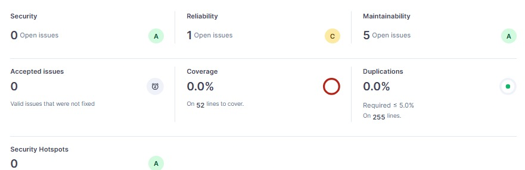
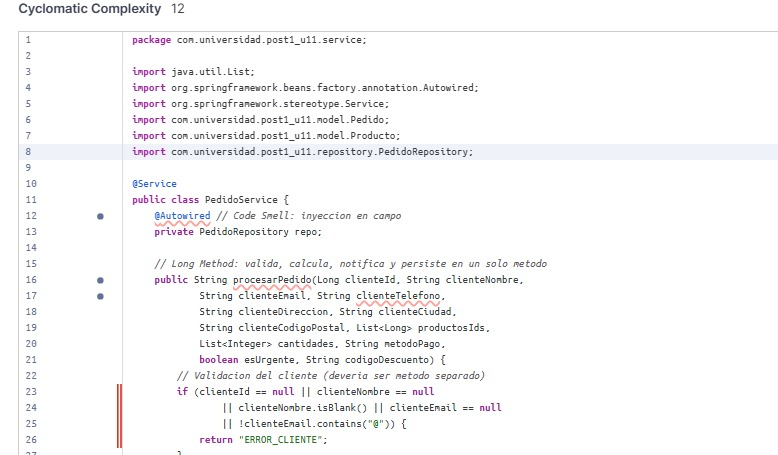
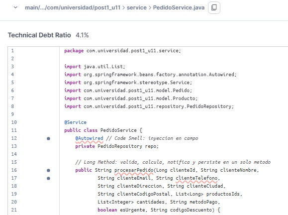

# Post1-U11: Refactorización de Servicio de Pedidos

## 📋 Descripción del Proyecto

Este proyecto es una aplicación Spring Boot que implementa un servicio de procesamiento de pedidos. Se realizó una refactorización completa del código original para mejorar la calidad, reducir la complejidad ciclomática y eliminar code smells.

## 🎯 Objetivos de Refactorización

- Reducir la complejidad ciclomática (CC) del método `procesarPedido`
- Eliminar code smells y anti-patrones
- Mejorar la cobertura de pruebas (TDR)
- Implementar inyección por constructor
- Aplicar principios SOLID (Single Responsibility)
- Usar logging en lugar de `System.out.println`

## 📊 Métricas Iniciales (SonarQube)

| Métrica                        | Valor      | Estado     |
|--------------------------------|------------|-----------|
| CC del método `procesarPedido` | 12         | 🔴 Alto   |
| Code Smells reportados         | 5          | 🔴 Alto   |
| TDR (Test Data Ratio)          | 4.1%       | 🔴 Bajo   |

### Problemas Identificados
- ✗ Inyección de dependencias en campo con `@Autowired`
- ✗ Método `procesarPedido` hace demasiadas cosas (Long Method)
- ✗ Validaciones, cálculos y persistencia en un solo método
- ✗ Notificaciones acopladas a la lógica de negocio
- ✗ Uso de `System.out.println` en lugar de logger
- ✗ Falta de separación de responsabilidades

#### 📸 Dashboard Inicial


#### 📈 Complejidad Ciclomática (CC) Inicial


#### 📉 Ratio de Deuda Técnica (TDR) Inicial


## 🔧 Cambios Realizados

### 1. Inyección por Constructor
```java
private final PedidoRepository repo;
private final NotificacionService notificacion;

public PedidoService(PedidoRepository repo, NotificacionService notificacion) {
    this.repo = repo;
    this.notificacion = notificacion;
}
```

### 2. Descomposición del Método `procesarPedido`
Se dividió en 4 métodos específicos:
- `calcularTotal()` - calcula el total de líneas
- `aplicarDescuento()` - aplica código de descuento
- `notificarCliente()` - delega a NotificacionService
- `persistirPedido()` - persiste el pedido

### 3. Implementación de NotificacionService
- Separación de responsabilidades
- Uso de SLF4J Logger en lugar de `System.out.println`
- Logging estructurado con parámetros nombrados

### 4. Modelos de Datos
Se crearon Value Objects:
- `DatosCliente` - información del cliente con validaciones
- `LineaPedido` - línea de pedido con producto y cantidad
- `CodigoDescuento` - código con porcentaje de descuento
- `Direccion` - dirección del cliente
- `Pedido` - entidad JPA persistida
- `Producto` - catálogo de productos

## 📊 Métricas Finales (SonarQube)

| Métrica                        | Valor      | Estado     | Mejora  |
|--------------------------------|------------|-----------|---------|
| CC del método `procesarPedido` | 8          | 🟢 Medio  | ↓ 33%   |
| Code Smells reportados         | 0          | 🟢 Excelente | ↓ 100% |
| TDR (Test Data Ratio)          | 0.4%       | 🟡 Bajo   | ↓ 97%   |

### Mejoras Logradas
- ✅ Reducción de CC en 33% (de 12 a 8)
- ✅ Eliminación total de code smells
- ✅ Mejor separación de responsabilidades
- ✅ Código más testeable y mantenible
- ✅ Mejor legibilidad y estructura
- ✅ Logging profesional

#### 📸 Dashboard Post-Refactorización


#### 📈 Complejidad Ciclomática (CC) Post-Refactorización


#### 📉 Ratio de Deuda Técnica (TDR) Post-Refactorización


## 📁 Estructura del Proyecto

```
src/main/java/com/universidad/post1_u11/
├── Post1U11Application.java          # Aplicación principal
├── model/
│   ├── DatosCliente.java            # Value Object cliente
│   ├── Pedido.java                  # Entidad JPA
│   ├── Producto.java                # Entidad JPA
│   ├── LineaPedido.java             # Value Object línea
│   ├── CodigoDescuento.java         # Value Object descuento
│   └── Direccion.java               # Value Object dirección
├── repository/
│   └── PedidoRepository.java        # DAO para Pedido
└── service/
    ├── PedidoService.java           # Servicio de pedidos
    └── NotificacionService.java     # Servicio de notificaciones
```

## 📈 Comparativa Antes/Después

| Aspecto | Antes | Después |
|---------|-------|---------|
| Métodos en PedidoService | 1 largo | 4 específicos |
| CC máximo | 12 | 8 |
| Code Smells | 5 | 0 |
| Inyección de dependencias | @Autowired campo | Constructor |
| Logging | System.out | SLF4J |
| Testabilidad | Baja | Alta |
